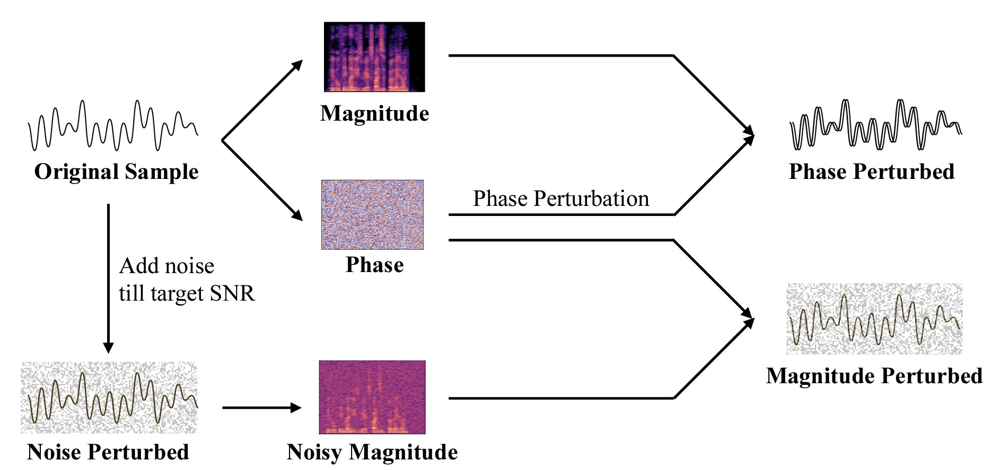

# [Phase Perturbation Improves Channel Robustness for Speech Spoofing Countermeasures](https://www.isca-speech.org/archive/interspeech_2023/zang23_interspeech.html)

[](https://github.com/yongyizang/PhaseAntispoofing_INTERSPEECH) | [](https://arxiv.org/abs/2306.03389)

Official repository of the Interspeech 2023 paper "Phase Perturbation Improves Channel Robustness for Speech Spoofing Countermeasures." [[ISCA link](https://www.isca-speech.org/archive/interspeech_2023/zang23_interspeech.html)]



## Abstract
In this paper, we aim to address the problem of channel robustness in speech countermeasure (CM) systems, which are used to distinguish synthetic speech from human natural speech. On the basis of two hypotheses, we suggest an approach for perturbing phase information during the training of time-domain CM systems. Communication networks often employ lossy compression codec that encodes only magnitude information, therefore heavily phase information. Also, state-of-the-art CM systems rely on phase information to identify spoofed speech. Thus, we believe the information loss in the phase domain induced by lossy compression codec degrades the performance of the unseen channel. We first establish the dependence of time-domain CM systems on phase information by perturbing phase in evaluation, showing strong degradation. Then, we demonstrated that perturbing phase during training leads to a significant performance improvement, whereas perturbing magnitude leads to further degradation.

## Citation
```
@inproceedings{zang23phase,
  author={Yongyi Zang and You Zhang and Zhiyao Duan},
  title={{Phase perturbation improves channel robustness for speech spoofing countermeasures}},
  year=2023,
  booktitle={Proc. Interspeech},
  pages={3162--3166},
  doi={10.21437/Interspeech.2023-2039}
}
```


